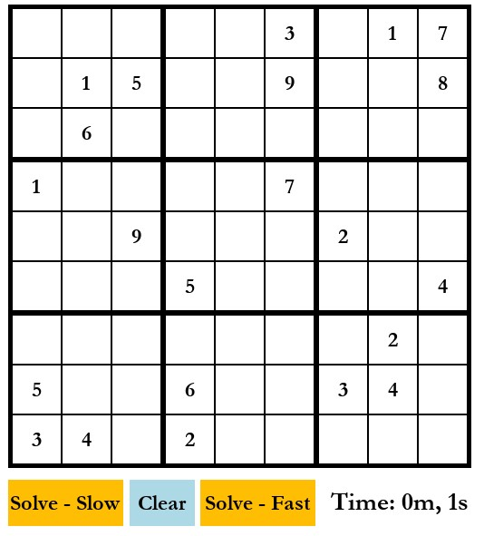

"# soduku-solver" 

Adaptive Thresholding Values:
Blocksize: 9                 # On board_web2 a square's side dissapears - only when size is less than 500x500
C: 7
	
Blocksize: 11                # On board_web2 a square's side dissapears when screen size 400x400, board_web.jpg when screen size 500x500
C: 9                         

Blocksize: 23                # So far, the best, only a tiny bit of noise on board_web and a bit of blocky white on board_web2 when 500x500
C: 7

Blocksize: 14               # Same as above, maybe teensy bit worse.
C: 6

Blocksize: 14               # Same as above, better on 500x500 for sure
C: 7

